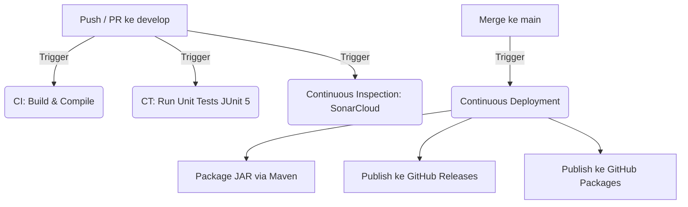

# Sistem Ulasan pada E-Commerce - Implementasi dengan Konsep OOP pada Java

## Tujuan Laporan

Laporan ini bertujuan untuk mendokumentasikan dan menjelaskan struktur serta fungsionalitas dari **Sistem Ulasan Produk** dalam platform e-commerce yang dibangun menggunakan konsep **Object-Oriented Programming (OOP)** pada bahasa pemrograman **Java**. Dalam laporan ini, kami akan mengidentifikasi kelas-kelas utama, atribut, metode, serta hubungan antar kelas yang ada dalam sistem ulasan.

## Struktur Sistem Ulasan Produk

Sistem ulasan produk terdiri dari beberapa kelas yang saling berinteraksi untuk memberikan fungsionalitas yang lengkap pada platform e-commerce. Berikut adalah struktur dan deskripsi setiap kelas dalam sistem ini:

### 1. **Pengguna (User)**
   - **Atribut**: Nama, email, password, nomorTelepon
   - **Metode**:
     - `setNama()`, `setEmail()`, `setPassword()`, `setNomorTelepon()`
   - **Deskripsi**: Kelas ini bertindak sebagai dasar untuk pengguna yang dapat mengelola informasi profil mereka. Pengguna bisa menjadi **Moderator**, **Penjual**, atau **Pelanggan** yang memiliki peran masing-masing dalam sistem.

### 2. **Pelanggan (Customer)**
   - **Atribut**: Daftar Ulasan
   - **Metode**:
     - `tulisUlasan()`, `editUlasan()`, `laporkanUlasan()`
   - **Deskripsi**: Pelanggan dapat memberikan ulasan produk, mengedit ulasan mereka, atau melaporkan ulasan yang dianggap tidak valid.

### 3. **Penjual (Seller)**
   - **Atribut**: Daftar Produk, Daftar Ulasan
   - **Metode**:
     - `balasUlasan()`
   - **Deskripsi**: Penjual dapat menanggapi ulasan yang diberikan oleh pelanggan, baik itu berupa kritik maupun pujian terhadap produk yang dijual.

### 4. **Moderator**
   - **Atribut**: Daftar Ulasan yang Dihapus
   - **Metode**:
     - `verifikasiUlasan()`, `hapusUlasan()`
   - **Deskripsi**: Moderator memiliki peran penting dalam memverifikasi keaslian ulasan yang masuk, memastikan bahwa ulasan tersebut tidak melanggar kebijakan platform.

### 5. **Produk (Product)**
   - **Atribut**: Nama Produk, Harga, Deskripsi
   - **Metode**:
     - `tambahProduk()`, `editProduk()`
   - **Deskripsi**: Produk adalah entitas utama dalam sistem ini yang memiliki ulasan. Setiap produk dapat memiliki beberapa ulasan yang terkait dengan kualitas produk dan pengalaman pelanggan.

### 6. **Ulasan (Review)**
   - **Atribut**: Rating, Komentar
   - **Metode**:
     - `validasiRating()`, `verifikasiUlasan()`
   - **Deskripsi**: Kelas ini menyimpan ulasan yang diberikan oleh pelanggan terhadap produk tertentu. Ulasan ini dapat dinilai oleh pelanggan berdasarkan rating dan komentar.

### 7. **UlasanToko (StoreReview)**
   - **Atribut**: Rating dari beberapa aspek (Pengemasan, Pelayanan, Pengiriman, dll)
   - **Metode**:
     - `tulisUlasanToko()`, `laporkanUlasanToko()`
   - **Deskripsi**: Ulasan ini memberikan penilaian secara keseluruhan terhadap toko yang menjual produk, meliputi berbagai aspek seperti pelayanan, pengemasan, dan pengiriman.

### 8. **BalasUlasan (ReplyReview)**
   - **Atribut**: Komentar Balasan
   - **Metode**:
     - `balasUlasan()`
   - **Deskripsi**: Kelas ini memungkinkan penjual untuk membalas ulasan yang diberikan oleh pelanggan, memberikan respons terhadap masukan yang diberikan.

## Fungsionalitas dan Relasi Antar Kelas

1. **Pelanggan** memberikan ulasan pada **Produk**. Ulasan ini kemudian disimpan dalam kelas **Ulasan** yang terkait dengan produk yang diberikan ulasan.
2. **Penjual** dapat memberikan balasan pada **Ulasan** yang diberikan oleh pelanggan, dengan menggunakan kelas **BalasUlasan**.
3. **Moderator** memverifikasi keaslian **Ulasan** dan menghapus ulasan yang tidak valid atau melanggar kebijakan platform.
4. **UlasanToko** memungkinkan pelanggan untuk memberikan penilaian terhadap toko, sementara **Penjual** dapat menanggapi ulasan ini.

## Peran Pengguna dalam Sistem

- **Pelanggan** memiliki peran utama dalam memberikan ulasan dan penilaian terhadap produk dan toko. Mereka juga dapat melaporkan ulasan yang tidak sesuai.
- **Penjual** dapat membalas ulasan yang diberikan oleh pelanggan dan memberikan klarifikasi atau respons terhadap kritik.
- **Moderator** bertanggung jawab untuk memverifikasi ulasan dan menjaga kualitas sistem ulasan dengan menghapus ulasan yang tidak valid.

## Validitas dan Keamanan Ulasan

Untuk menjaga validitas ulasan, sistem ini mengimplementasikan metode **validasiRating()** untuk memastikan bahwa rating yang diberikan oleh pelanggan sesuai dengan kriteria yang telah ditetapkan. Selain itu, **verifikasiUlasan()** memastikan bahwa ulasan yang diberikan tidak mengandung konten yang tidak sesuai atau palsu.

## Class Diagram


---

## 1. Arsitektur Pipeline CI/CD

Proyek ini menerapkan alur otomatisasi *Continuous Integration* (CI), *Continuous Testing* (CT), *Continuous Inspection*, dan *Continuous Deployment* (CD) menggunakan GitHub Actions.



Alur kerja branching yang diterapkan:
- **Branch `develop`**: Digunakan sebagai tempat pengembangan fitur baru. Setiap ada `push` atau `pull_request` ke branch `develop` (atau branch fitur), sistem otomatis memicu workflow CI (Validasi & Kompilasi), CT (Unit Testing), dan Continuous Inspection (SonarCloud) untuk memastikan kualitas kode terjaga.
- **Branch `main`**: Branch produksi utama. Penggabungan kode (*merge*) ke branch `main` secara otomatis memicu proses **Continuous Deployment (CD)** untuk membuat rilis baru di GitHub Releases beserta pemublikasian paket `.jar` ke GitHub Packages.

---

## 2. Pembagian Tugas Kelompok

| Nama Anggota | NIM | Tanggung Jawab |
| :--- | :--- | :--- |
| **Dhea Sri Noor Septianiz** | 103022300072 | Continous Integration |
| **Rahmah Aisyah** | 103022300014 |Continous Testing |
| **Dina Salsabilla** | 103022300154 |Continous Inspection |
| **Muhammad Fauzan** | 103022300065 |Continous Deployment |


*(Silakan sesuaikan tabel pembagian tugas di atas dengan kesepakatan riil kelompok Anda)*

---

## 3. Tools dan Teknologi Pipeline CI/CD

| Tahap Pipeline | Tools / Teknologi | Deskripsi |
| :--- | :--- | :--- |
| **Version Control System** | Git & GitHub | Penyimpanan repositori, strategi branching (`develop`/`main`), dan pemicu alur kerja. |
| **Package & Build Tool** | Apache Maven (v3) | Manajemen dependensi, kompilasi proyek, dan proses pemaketan aplikasi. |
| **Continuous Integration (CI)** | GitHub Actions | Orkestrasi otomatisasi untuk compile proyek pada setiap push/PR. |
| **Continuous Testing (CT)** | JUnit 5 & JaCoCo | Kerangka kerja unit testing (Surefire plugin) dan analisis cakupan kode (*code coverage*). |
| **Continuous Inspection** | SonarCloud | Analisis statis kualitas kode, pemindaian potensi bug, kerentanan keamanan, serta Quality Gate. |
| **Continuous Deployment (CD)** | GitHub Releases & Packages | Tempat publikasi otomatis berkas executable `.jar` siap pakai. |

---

## 4. Panduan Menjalankan Proyek Secara Lokal

### Prasyarat:
- Pastikan sudah ter-install **Java Development Kit (JDK 21)**.
- Pastikan sudah ter-install **Apache Maven**.

### Langkah-langkah:
1. **Clone Repositori**:
   ```bash
   git clone https://github.com/tjhhh/Tubes-MKEPL.git
   cd Tubes-MKEPL
   ```
2. **Kompilasi & Pemaketan Aplikasi**:
   Jalankan perintah berikut untuk mengunduh dependensi, mengompilasi kode, dan membungkus aplikasi menjadi berkas `.jar`:
   ```bash
   mvn clean package
   ```
3. **Menjalankan Aplikasi**:
   Setelah proses package selesai, jalankan berkas `.jar` yang dihasilkan di dalam folder `target/`:
   ```bash
   java -jar target/main-1.0-SNAPSHOT.jar
   ```
4. **Menjalankan Unit Test secara Lokal**:
   Untuk mengeksekusi semua berkas pengujian JUnit 5 di komputer lokal, gunakan perintah:
   ```bash
   mvn test
   ```


